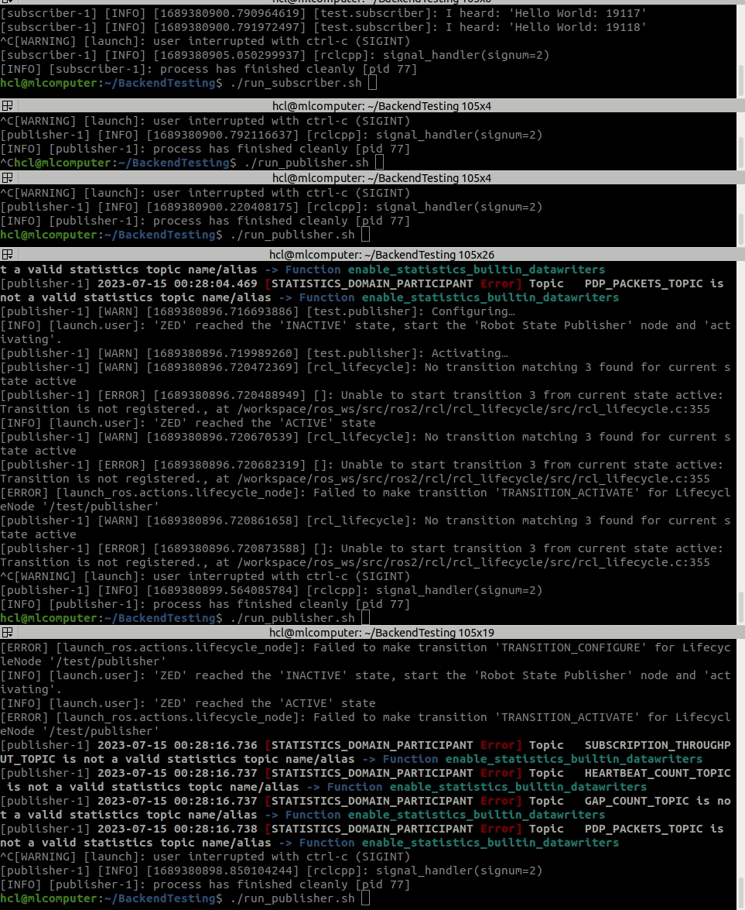

# RosServiceChecker
A repository with scripts to verify a bug in ROS2 lifecycles.

When using ROS2 lifecycles, nodes get stuck in a half configured state.
Most noticable is that, once a new node is launched, the previous nodes get activated aswell, potentially hiding the bug, when launch multiple nodes, and when launch on resource constraint systems.

## Setup

Clone with git:
```
git clone https://github.com/HansLarsen/RosServiceChecker.git
```

Enter the directory
```
cd RosServiceChecker
```

Download the required packages, this is in order to compile both fastdds and ros2.
```
./setup_sources.sh
```

Compile the workspaces with ros and fastdds.
Once the build\_backend.sh has been run once, the build\_test\_package script allows for only the test nodes to be build.
```
./build_backend.sh
```

Run the publisher and subscriber.
For every subscriber and publisher a new terminal is needed.
```
./run_publisher.sh
./run_subscriber.sh
```

# Video of the bug

